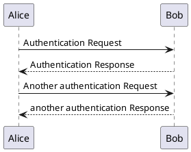

## About

This plugin adds support for UML diagrams to be created from text, using [PlantUML](http://plantuml.com) syntax. Text
diagrams will be converted to SVG and embedded directly in your page content. Having diagrams described in text makes 
them easy to create and maintain, and enables them to be tracked with Git, ideal for managing diagrams for 
project documentation.

Note that some diagram types require GraphViz to be installed on your local machine to work properly.

## Demo

<details>
<summary>Examples</summary>




The following examples are taken directly from the official [PlantUML docs](http://plantuml.com/)

### Sequence Diagram

[source](http://plantuml.com/sequence-diagram)

```text
Alice -> Bob: Authentication Request
Bob --> Alice: Authentication Response

Alice -> Bob: Another authentication Request
Alice <-- Bob: another authentication Response
```


Alice -> Bob: Authentication Request
Bob --> Alice: Authentication Response

Alice -> Bob: Another authentication Request
Alice <-- Bob: another authentication Response


### Class Description

[source](http://plantuml.com/class-diagram)

```text
class Dummy {
 -field1
 #field2
 ~method1()
 +method2()
}
```


class Dummy {
 -field1
 #field2
 ~method1()
 +method2()
}


### Activity Diagram

[source](http://plantuml.com/activity-diagram-beta)

```text
start
if (condition A) then (yes)
  :Text 1;
elseif (condition B) then (yes)
  :Text 2;
  stop
elseif (condition C) then (yes)
  :Text 3;
elseif (condition D) then (yes)
  :Text 4;
else (nothing)
  :Text else;
endif
stop
```


start
if (condition A) then (yes)
  :Text 1;
elseif (condition B) then (yes)
  :Text 2;
  stop
elseif (condition C) then (yes)
  :Text 3;
elseif (condition D) then (yes)
  :Text 4;
else (nothing)
  :Text else;
endif
stop


### State Diagram

[source](http://plantuml.com/state-diagram)

```text
scale 350 width
[*] --> NotShooting

state NotShooting {
  [*] --> Idle
  Idle --> Configuring : EvConfig
  Configuring --> Idle : EvConfig
}

state Configuring {
  [*] --> NewValueSelection
  NewValueSelection --> NewValuePreview : EvNewValue
  NewValuePreview --> NewValueSelection : EvNewValueRejected
  NewValuePreview --> NewValueSelection : EvNewValueSaved
  
  state NewValuePreview {
    State1 -> State2
  }  
}
```


scale 350 width
[*] --> NotShooting

state NotShooting {
  [*] --> Idle
  Idle --> Configuring : EvConfig
  Configuring --> Idle : EvConfig
}

state Configuring {
  [*] --> NewValueSelection
  NewValueSelection --> NewValuePreview : EvNewValue
  NewValuePreview --> NewValueSelection : EvNewValueRejected
  NewValuePreview --> NewValueSelection : EvNewValueSaved

  state NewValuePreview {
    State1 -> State2
  } 
}


### Timing Diagram

[source](http://plantuml.com/timing-diagram)

```text
robust "Web Browser" as WB
concise "Web User" as WU

WB is Initializing
WU is Absent

@WB
0 is idle
+200 is Processing
+100 is Waiting
WB@0 <-> @50 : {50 ms lag}

@WU
0 is Waiting
+500 is ok
@200 <-> @+150 : {150 ms}
```


robust "Web Browser" as WB
concise "Web User" as WU

WB is Initializing
WU is Absent

@WB
0 is idle
+200 is Processing
+100 is Waiting
WB@0 <-> @50 : {50 ms lag}

@WU
0 is Waiting
+500 is ok
@200 <-> @+150 : {150 ms}





</details>

## Usage

### Basic Usage

Using this plugin adds support for the `.uml` and `.puml` file extension to be recognized by Orchid. Any file that 
Orchid reads, such as blogs, static pages, or changelog versions, can use the `.uml` extension and be compiled as a 
PlantUML diagram.

```text
. / (resources root)
├── homepage.md
├── config.yml
└── pages/
    └── registration-flow.puml <-- page content will be compiled to an SVG diagram
```

Alternatively, you may wish to embed diagrams within the content of another page. You can do this inline with the 
`compileAs()` template function.

```markdown
// homepage.md
---
---


Alice -> Bob: Authentication Request
Bob --> Alice: Authentication Response

Alice -> Bob: Another authentication Request
Alice <-- Bob: another authentication Response

```

You may also use the `load()` function to embed it from another file.

```puml
// diagram.uml
Alice -> Bob: Authentication Request
Bob --> Alice: Authentication Response

Alice -> Bob: Another authentication Request
Alice <-- Bob: another authentication Response
```

```markdown
// homepage.md
---
---

{{ load('diagram.uml') | raw }} # loads content of `diagram.uml`, compiles it as PlantUML, and embeds the result  
```

### Compiling Multiple Diagrams At Once

By default, Orchid does not need the `@startuml...@enduml` tags to compile diagram content; it will add them if they do
not exist. However, if you include multiple diagrams in a single file, each with their own `@startuml...@enduml` tags,
they will each be compiled as diagrams separately and embedded as separate SVG diagrams.



### Other Diagram Types

If you omit the start/end tags from your diagram source, Orchid will assume it is a "UML" diagram and add 
`@startuml...@enduml` for you. However, PlantUML supports a variety of diagram formats, using differing start/end tags.
The following tags are supported by Orchid and PlantUML:

- `@startuml/@enduml`
- `@startsalt/@endsalt`
- `@startmath/@endmath`
- `@startlatex/@endlatex`
- `@startgantt/@endgantt`
